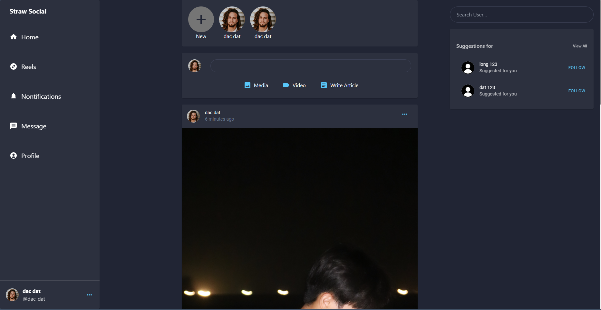

# Straw Social



<h1> Getting Started </h1>
<p> To start working on this project, follow these steps:</p>

### To intsall all the required dependecies

```
npm install
```

## Start the project

```
npm start
```

Runs the app in the development mode.<br>
Open [http://localhost:3000](http://localhost:3000) to view it in the browser.

### Test the application

```
npm test
```

Launches the test runner in the interactive watch mode.<br>
See the section about [running tests](https://facebook.github.io/create-react-app/docs/running-tests) for more information.

### Build application

```
npm run build
```

Builds the app for production to the `build` folder.<br>

